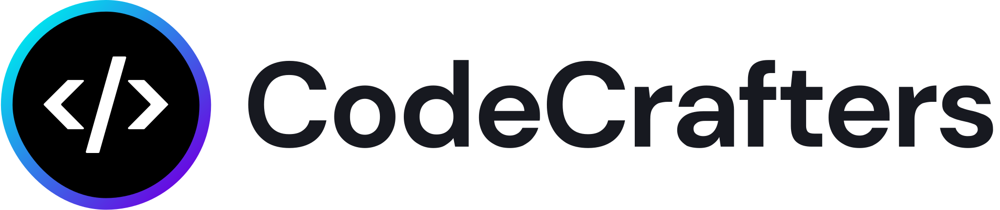

<!DOCTYPE html>
<html lang="en">
<head>
  <meta charset="UTF-8" />
  <meta name="viewport" content="width=device-width, initial-scale=1.0" />
  <title>CodeMirror Example</title>
  <!-- Link to CodeMirror CSS (optional if you're using CodeMirror) -->
  <link rel="stylesheet" href="/style.css">
</head>
<!-- <link rel="stylesheet" href="style.css"> -->
<body>

  <header>
    

      <a class="logo" href="./">CodeMirror</a>
      <h1>Extensible Code Editor</h1>
      <!-- <h2>Examples</h2> -->
    

    <ul>
      <li><a href="#">Example</a></li>
      <li><a href="#">Documentation</a></li>
      <li><a href="#">Try</a></li>
      <li><a href="#">Discuss</a></li>
      <li><a href="#">GitHub</a></li>
      <!-- <li><a href="#">Version 5</a></li> -->
      <a href="https://codemirror.net/5/">Version</a>
    </ul>
  </header>

  <main>
    

      CodeMirror is a code editor component for the web. It can be used in websites to implement a text input
      field with support for many editing features, and has a rich programming interface to allow further
      extension.
    

     

    <label for="code">Write your code here:</label> 
    <textarea id="code" rows="10" cols="50" placeholder="Enter your code here..."></textarea>

      

    
This is a CodeMirror field, configured for editing JavaScript code.

    <h2>features list</h2>
    

    

      

        <h3>Accessibility</h3>
        
Works well with screen readers and keyboard-only users.

      

      

        <h3>Mobile Support</h3>
        
Use the platform's native selection and editing features on phones.

      

      

        <a href="https://codemirror.net/docs/ref/#view.EditorView.bidiSpans" class="blocklink">
          <h3>Bidirectional Text</h3>
          
Support mixing of right-to-left and left-to-right text.

        </a>
      

      

        <a href="https://codemirror.net/examples/lang-package/" class="blocklink">
          <h3>Syntax highlighting</h3>
          
Color code to reflect syntactic structure.

        </a>
      

      

        <a href="https://codemirror.net/docs/ref/#view.lineNumbers" class="blocklink">
          <h3>Line Number</h3>
          
Display gutters with line numbers or other information next to the code.

        </a>
      

      

        <a href="https://codemirror.net/examples/autocompletion/" class="blocklink">
          <h3>autocompletion</h3>
          
Provide language-specific completion hints in the editor.

        </a>
      

      

        <a href="https://codemirror.net/docs/ref/#language.foldCode" class="blocklink">
          <h3>Code Fielding</h3>
          
Temporarily hide parts of the document.

        </a>
      

      

        <a href="https://codemirror.net/docs/ref/#search" class="blocklink">
          <h3>Search/Replace</h3>
          
Detailed parse trees allow many types of language integration..

        </a>
        

          <a href="https://codemirror.net/docs/ref/#language.syntaxTree" class="blocklink">
            <h3>Full Parsing</h3>
            
Detailed parse trees allow many types of language integration.

          </a>
        

        <h4>About</h4>
        

        
CodeMirror is open source under a permissive license <a
            href="https://github.com/codemirror/dev/blob/main/LICENSE">(MIT)</a>. It is being developed on <a
            href="https://github.com/codemirror/dev">GitHub.</a>Contributions are welcome.

        <b>If you are using CodeMirror <u>commercially</u>, there is a <u>social</u> (but no legal) expectation that you
          help fund its maintenance. <a href="https://marijnhaverbeke.nl/fund/"> Start here.</a></b>
        <pre>The library supports browsers up from Internet Explorer 11 (with <a href="https://codemirror.net/examples/ie11/">some polyfills</a>).
         </pre>
        
Discussing the project, or asking questions, is best done on the <a
            href="https://discuss.codemirror.net/">forum.</a> Bugs should be reported through the <a
            href="https://github.com/codemirror/dev/issues"> issue tracker.</a> We aim to be an inclusive, welcoming
          community. To make that explicit, we have a <a
            href="https://www.contributor-covenant.org/version/1/1/0/code-of-conduct/">code of conduct</a> that applies
          to communication around the project.

        <h3>Language Support</h3>
        

        
A full parser package, often with language-specific integration and extension code, exists for the following
          languages:

        <ul class="grid-list-5">
          <li> <a href="https://github.com/codemirror/lang-angular" class="blocklink">
              <strong>Angular</strong>
            </a>
          </li>
          <li> <a href="https://github.com/codemirror/lang-css" class="blocklink">
              <strong>CSS</strong>
            </a>
          </li>
          <li> <a href="http://github.com/codemirror/lang-cpp" class="blocklink">
              <strong>C++</strong>
            </a>
          </li>
          <li> <a href="https://github.com/codemirror/lang-go" class="blockllink">
              <strong>Go</strong>
            </a>
          </li>
          <li> <a href="https://github.com/codemirror/lang-html" class="blocklink">
              <strong>HTML</strong>
            </a>

          </li>
        </ul>
        
There is also a collection of <a href="https://github.com/codemirror/legacy-modes">CodeMirror 5 modes</a>
          that can be used, and a list of <a href="https://codemirror.net/docs/community/#language">community-maintained
            language packages</a>. If your language is not listed above, you may still find a solution there.

        <h4>Sponsors</h4>
        

        
These wonderful companies and organizations help fund development and maintenance of CodeMirror.

        
         
        
         
        <a href="https://www.holmusk.com/">
           
        Holmusk
         
        </a>
        
  </main>

  <footer>
    

    <a href="https://www.contributor-covenant.org/version/1/1/0/code-of-conduct/">Code of Conduct</a>
    <a href="https://github.com/codemirror/dev/issues">Report an Issue</a>

    

    
&copy; 2025 CodeMirror
      Clone | Created by Ritesh

  </footer>

  <!-- JavaScript (optional external script) -->
  
</body>
</html>
